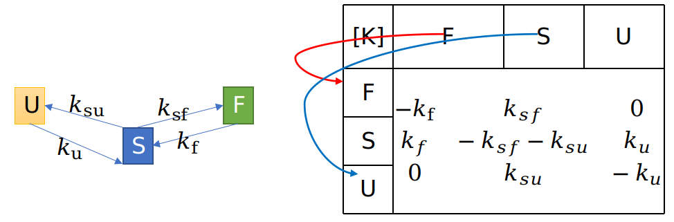

# Usage of gSMFRETda

The gSMFRETda can analysis multi-state dynamic systems. It uses conversion rate matrix, which is shown in figure below, to represent systems' multi-state dynamic properties.
The element <!--![K_{i,j}]--> in the matrix represent the conversion rate from the state j to the state i. When i=j, the element equal to negative numbers of sum of other elements in the column.

The matrix of below figure represent the dynamic system in the left subfigure above. In case you want to specify the kinetic model to be used in the calculation as shown above, you can add the argument "-k" to the pdaServ program to define the conversion rate matrix as . 
Specifically, you need to add "-k 3 7" to set ke_zero=[3,7] in this case to setup which element is zero. Index start from 1, matrix is setted RowMajor.